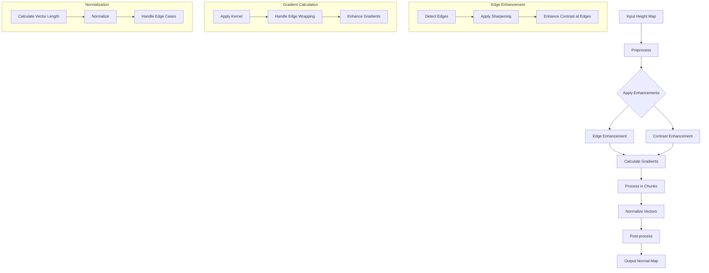

# Normal Map Generator Improvement Plan

## Issues Identified

1. **Edge Wrapping Not Enabled**: The command is using `0` for the wrap parameter, which means edge wrapping is disabled. This is likely why the normal map doesn't properly wrap around the texture.

2. **Low Edge Enhancement**: The edge enhancement factor is set to `1.0`, which is much lower than the default value of `5.0`. This could be why the edges aren't as sharp and defined.

3. **Excessive Blurring**: There's a duplicate call to `apply_gaussian_blur` at lines 249 and 253, which is causing double blurring.

4. **Alpha Channel Bug**: There's a bug in line 225 where it checks for 'RGB' mode instead of 'RGBA' mode for alpha channel detection.

5. **Gradient Calculation**: The current gradient calculation might not be optimal for creating sharp, well-defined normal maps.

6. **Normalization Issues**: The normalization of vectors might not be handling edge cases correctly.

## Improvement Plan

### 1. Fix Immediate Bugs

1. Remove the duplicate blur application (lines 249-253)
2. Fix the alpha channel detection bug (line 225)

### 2. Enhance Edge Definition

1. Improve the `enhance_edges` function to create sharper edges
2. Modify the `process_chunk` function to better handle edge cases

### 3. Improve Gradient Calculation

1. Enhance the gradient calculation to produce more defined normal maps
2. Add an option for more aggressive edge detection

### 4. Optimize Edge Wrapping

1. Improve the edge wrapping implementation for seamless textures
2. Ensure proper padding and cropping
3. Set edge wrapping to be on by default

### 5. Add Advanced Features

1. Add a "sharpness" parameter to control the overall sharpness of the normal map
2. Implement a more sophisticated normalization method

## Process Flow Diagram

## Specific Code Changes

### 1. Fix Duplicate Blur Application
Remove one of the calls to `apply_gaussian_blur` to prevent excessive blurring.

### 2. Fix Alpha Channel Detection
Change `has_alpha = input_image.mode == 'RGB'` to `has_alpha = input_image.mode == 'RGBA'` for proper alpha channel detection.

### 3. Improve Edge Enhancement
Enhance the `enhance_edges` function to create sharper, more defined edges:
- Add adaptive thresholding for edge detection
- Implement multi-scale edge enhancement
- Add directional edge enhancement

### 4. Enhance Gradient Calculation
Improve the gradient calculation for better normal maps:
- Implement custom kernels for better edge detection
- Add support for multi-scale gradient calculation
- Enhance gradient normalization

### 5. Optimize Edge Wrapping
Improve edge wrapping for seamless textures:
- Set edge wrapping to be on by default
- Enhance padding and cropping logic
- Implement better handling of edge cases

### 6. Add Sharpness Parameter
Add a new parameter to control the overall sharpness of the normal map:
- Implement a sharpness enhancement function
- Add command-line parameter for sharpness control
- Integrate sharpness with edge enhancement

### 7. Improve Normalization
Implement a more sophisticated normalization method:
- Better handling of edge cases
- Improved vector normalization
- Enhanced handling of flat areas